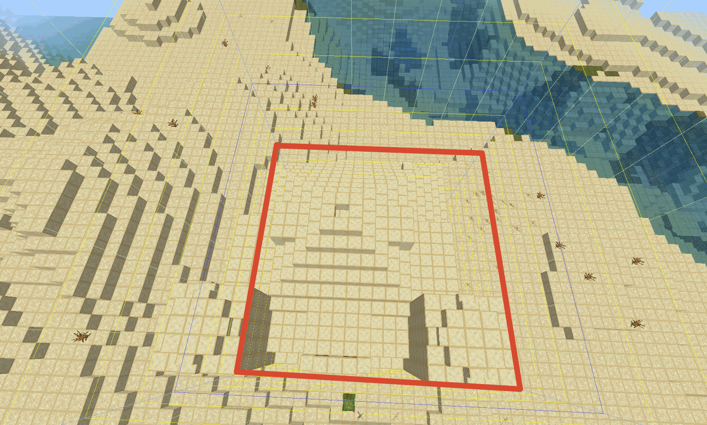
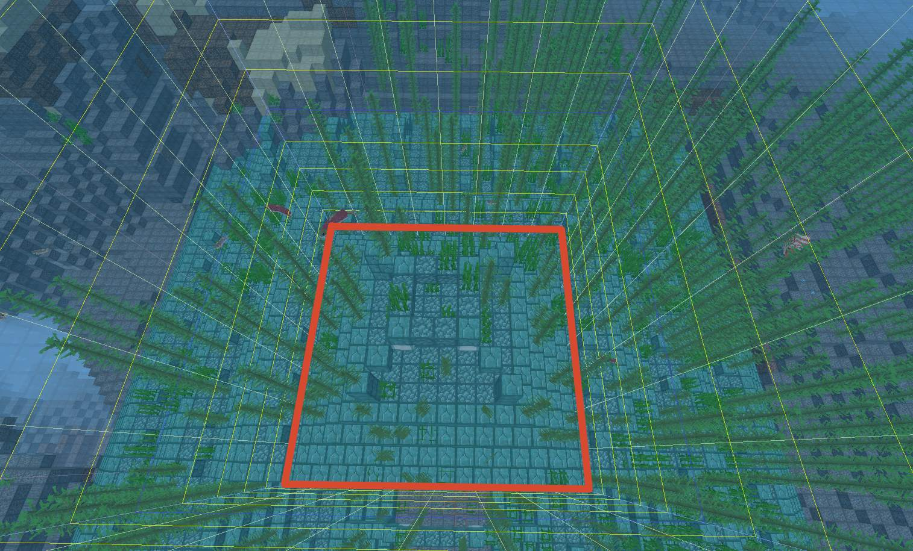
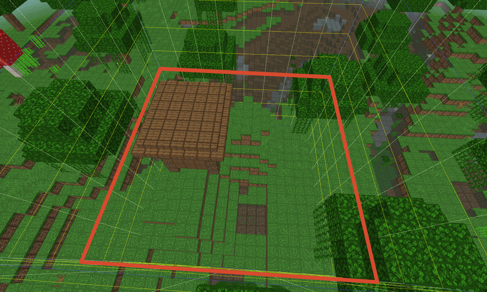
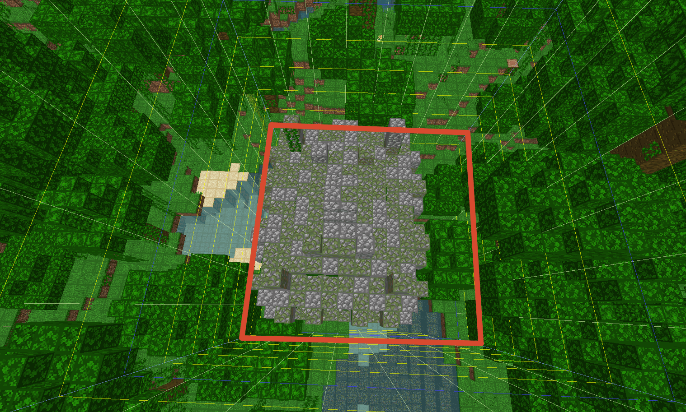
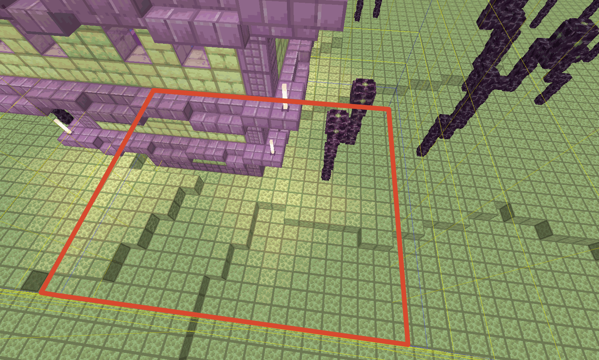
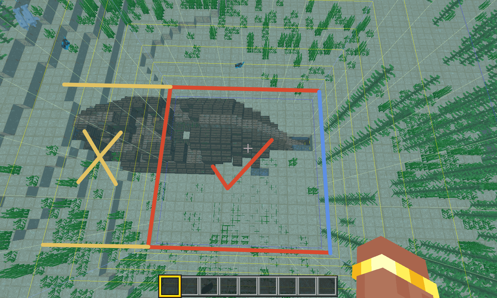
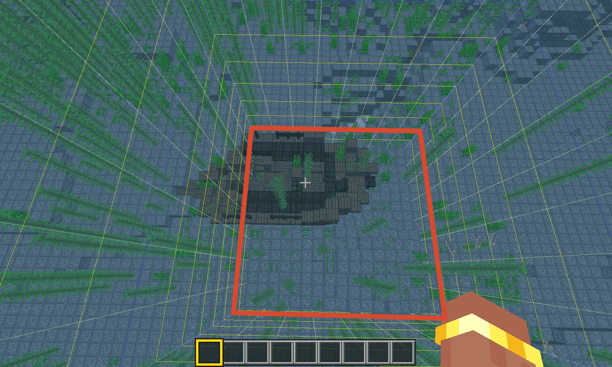
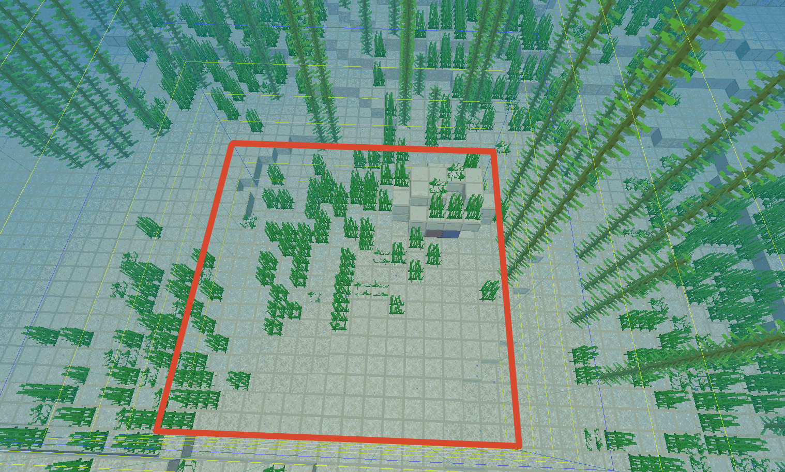
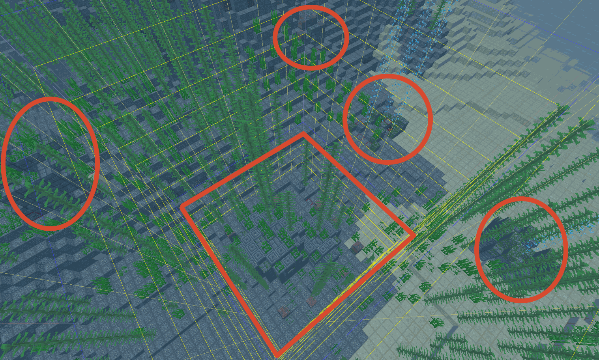

# MCBEseedcracker (Windows)

English | [简体中文](README_CN.md)

Windows desktop application with graphical interface, no command line required.

---

## Project Structure

```
MCBEseedcracker_win_ui/
├── ui/                          # UI source code
│   ├── main_window.py           # Main window
│   ├── workers/                 # Worker threads
│   │   ├── low32_worker.py      # Low 32-bit cracking (GPU/CPU)
│   │   └── high32_worker.py     # High 32-bit cracking
│   ├── widgets/                 # UI widgets
│   ├── data/                    # Data files
│   └── utils/                   # Utilities
├── crack_low32/                 # Low 32-bit cracking library
│   ├── crack_low32.c            # CPU version source
│   ├── crack_low32_opencl.c     # GPU version source
│   ├── crack_low32.cl           # OpenCL kernel
│   └── compile_opencl.bat       # OpenCL compilation script
├── crack_high32/                # High 32-bit cracking library
│   ├── crack_high32.c           # High 32-bit source
│   └── cubiomes/                # Biome generation library
├── dll/                         # Compiled libraries
│   ├── crack_low32/
│   │   ├── crack_low32.dll      # CPU version
│   │   ├── crack_low32_opencl.dll  # GPU version
│   │   └── crack_low32.cl       # OpenCL kernel
│   └── crack_high32/
│       └── crack_high32.dll     # High 32-bit library
├── compile.bat                  # Compilation script
├── build.bat                    # PyInstaller packaging script
├── crack_config.json            # GPU configuration
└── main.py                      # Application entry point
```

---

### Windows Users (Recommended)

**Windows GUI Version** - no command line or code editing needed!

See [MCBEseedcracker_win_ui/README.md](README.md) for details.

**Features:**

- ✅ Graphical interface - no coding required
- ✅ Low 32-bit & High 32-bit cracking
- ✅ Progress save/restore
- ✅ Chinese/English support
- ✅ MC 1.18/1.19/1.20/1.21/26.XX support

## Usage

### 1. Low 32-bit Cracking (Structures)

1. Collect structure coordinates in-game (recommend 5 different structure types)
2. Click "Add Structure" button, enter structure type and coordinates
3. Select cracking range (test mode 0-100M or full mode 0-4.3B)
4. (Optional) Set the process count in the parameter settings on this page (default: auto-use all CPU cores, max 16 processes)
5. Click "Start Cracking"
6. Wait for completion, view candidate low 32-bit values

**Process Count Settings:**

- **GPU Mode**: Process count setting has no effect (GPU single-process, multi-thread parallel)
- **CPU Mode**: Process count can be manually set (default: use all cores, max 16 processes)
- **Recommendation**: Use default auto-setting, 16 processes is already optimal

---

### GPU Acceleration (Low 32-bit)

**Automatically detects and uses GPU if available, with automatic fallback to CPU.**

| Feature             | GPU Mode       | CPU Mode     |
| ------------------- | -------------- | ------------ |
| **Speed**           | ~150M seeds/s  | ~10M seeds/s |
| **Full Range Time** | ~30 seconds    | ~7 minutes   |
| **Speedup**         | **15x faster** | Baseline     |

**GPU Requirements:**

- NVIDIA GPU with Compute Capability 2.0+ (Fermi architecture or newer)
- AMD GPU with OpenCL 1.1+ support
- **Recommended**: RTX 20/30/40 series for best performance

**Old GPU Behavior:**

- GPUs with <10 compute units (e.g., MX330, GTX 550 Ti) are automatically detected and will use CPU mode
- Status bar shows current compute device (GPU/CPU)
- No manual configuration needed

**Configuration:**

Edit `crack_config.json` in the application directory:

```json
{
  "use_gpu": true,
  "auto_fallback": true,
  "seeds_per_thread": 256,
  "max_results": 10000
}
```

---

#### Supported Structures

| Name                    | Description               | Spread Type |
| ----------------------- | ------------------------- | ----------- |
| village                 | Village/Zombie Village    | triangular  |
| mansion                 | Woodland Mansion          | triangular  |
| end_city                | End City                  | triangular  |
| ocean_monument          | Ocean Monument            | triangular  |
| ancient_city            | Ancient City              | triangular  |
| buried_treasure         | Buried Treasure           | triangular  |
| pillager_outpost        | Pillager Outpost          | triangular  |
| ocean_ruins             | Ocean Ruins               | **linear**  |
| shipwreck               | Shipwreck                 | **linear**  |
| nether_complexes        | Nether Fortress/Bastion   | **linear**  |
| desert_temple           | Desert Temple             | **linear**  |
| igloo                   | Igloo                     | **linear**  |
| swamp_hut               | Witch Hut                 | **linear**  |
| jungle_temple           | Jungle Temple             | **linear**  |
| ruined_portal_overworld | Ruined Portal (Overworld) | **linear**  |
| ruined_portal_nether    | Ruined Portal (Nether)    | **linear**  |

> **Tip**: Prioritize **linear** type structures (Desert Temple, Witch Hut, Jungle Temple, Shipwreck). Linear types require less computation and crack faster. Structures with complex generation rules (Village, Igloo, Pillager Outpost, Ruined Portal) may appear offset by one chunk in-game — the 4-chunk grid automatically handles this, so they are safe to use.
>
> **Note**: Trail Ruins, Trial Chamber, and Abandoned Camp use the Java LCG random number generator and are used as optional acceleration in the **high 32-bit cracking** phase. They are listed in the [Java LCG Structures](#java-lcg-structures-optional-acceleration) section.

> ⚠️ **About Buried Treasure**: Although the parameters are correct, due to extremely high generation density (spacing=4 chunks), using it alone tends to produce many candidate seeds. Testing with 4 buried treasure samples yielded 400 candidate seeds in the 0-10000 seed range. Recommended only as a supplement when other structure samples are insufficient, or for verification purposes.

**The input structure coordinates can be any position within the structure's locating chunk.**

#### Structure Chunk Location Method

- **Desert Temple**: Chunk containing the center position

  

- **Ocean Monument**: Chunk containing the center position

  

- **Witch Hut**: Chunk with the largest building area

  

- **Jungle Temple**: Chunk with the largest building area

  

- **End City**: Chunk with the largest shulker box structure area at entrance

  

- **Shipwreck**: For complete ships, use the bow chunk (bow is roughly at the chunk boundary); for incomplete ships, use the chunk with the largest ship area

  Complete shipwreck:

  

  Incomplete shipwreck:

  

- **Ocean Ruins**: For single ruins, use the chunk with the largest ruins area; for ruins groups, use the chunk with the largest area of the middle ruins

  Single ocean ruins:

  

  Ocean ruins group:

  

- **Village**: (chunk location method to be added)

  

- **Igloo**: (chunk location method to be added)

  

- **Pillager Outpost**: (chunk location method to be added)

  

- **Woodland Mansion**: (chunk location method to be added)

  

- **Ruined Portal**: (chunk location method to be added)

  

- **Ancient City**: (chunk location method to be added)

  

---

### 2. High 32-bit Cracking (Biomes)

1. Collect biome sample coordinates in-game (recommend 5 different biomes)
2. **Select Bedrock version** (see version mapping table below)
3. Click "Add Biome" button, enter coordinates and biome type
4. Enter low 32-bit value (from low 32-bit cracking results)
5. (Optional) Set the process count in the parameter settings on this page (default: 16 processes, already optimal)
6. Click "Start Cracking"
7. Wait for completion, view full seed

**Process Count Settings:**

- **High 32-bit cracking only supports CPU mode**: Process count setting is effective
- **Default 16 processes**: This is the tested optimal value (avoids memory bandwidth saturation)
- **Recommendation**: Keep default 16 processes, more processes won't improve performance

**Optional: [Java LCG Structure Mode](#java-lcg-structures-optional-acceleration) (Recommended):** You can also add [Java LCG structures](#java-lcg-structures-optional-acceleration) (Trail Ruins / Trial Chamber / Abandoned Camp) in this tab. With 2-3 such structures, the cracker switches to a two-stage mode: bits 32-47 are derived directly from the structures, and only bits 48-63 are brute-forced with biome samples — dramatically faster than pure brute force. See [Java LCG Structures](#java-lcg-structures-optional-acceleration).

## Java LCG Structures (Optional Acceleration)

Three structures use the Java LCG random number generator in Bedrock Edition (instead of the standard MT19937): **Trail Ruins**, **Trial Chamber**, and **Abandoned Camp**.

When added in the high 32-bit cracking stage, these structures enable a two-stage mode:

1. **Stage 1 (bits 32-47)**: Java LCG structure positions directly constrain the seed's bits 32-47. Each structure reduces the candidates by a factor of ~65536; with 2-3 structures, a unique candidate for bits 32-47 is usually derived directly (no brute force needed).
2. **Stage 2 (bits 48-63)**: For each surviving candidate, the cracker iterates bits 48-63 (at most 65536 candidates) and verifies biome samples within your search range.

This is dramatically faster than the default full brute force over bits 32-47.

| Name          | Description               | Spread Type |
| ------------- | ------------------------- | ----------- |
| trail_ruins   | Trail Ruins               | linear      |
| trial_chamber | Trial Chamber             | linear      |
| abandoned_camp| Abandoned Camp            | linear      |

**Chunk Location Method:**

Same as regular structures, enter a position within the chunk where the structure is located (see [Structure Chunk Location Method](#structure-chunk-location-method)). The specific chunk determination methods for the three structures (with screenshots) will be added later:

- **Trail Ruins**: (chunk location method to be added)

  

- **Trial Chamber**: (chunk location method to be added)

  

- **Abandoned Camp**: (chunk location method to be added)

  

---

#### Version Mapping

| Bedrock Version     | Corresponding Java Version | Supported Biomes                                |
| ------------------- | -------------------------- | ----------------------------------------------- |
| **26.50**           | Java 26.3 (MC_26_3)        | ✅ Dappled Forest (new biome)                   |
| **26.30-26.40**          | Java 26.2 (Chaos Cubed)    | ✅ Sulfur Caves (new cave biome)                |
| **1.21.60-26.23**   | Java 1.21.5-26.1           | ✅ Pale Garden (expanded range)                 |
| **1.21.50**         | Java 1.21.4 (Winter Drop)  | ✅ Pale Garden (smaller range)                  |
| **1.21-1.21.40**    | Java 1.21.3                | ❌ No Pale Garden                               |
| **1.20.60-1.20.81** | Java 1.20                  | ✅ Cherry Grove                                 |
| **1.20.0-1.20.51**  | Java 1.20                  | ✅ Cherry Grove                                 |
| **1.19**            | Java 1.19                  | ✅ Deep Dark, Mangrove Swamp                    |
| **1.18**            | Java 1.18                  | ✅ Dripstone Caves, Lush Caves, Mountain biomes |

#### Pale Garden Version Differences

⚠️ **Important**: Pale Garden generation range differs between versions:

| MC Version        | Pale Garden Generation                    |
| ----------------- | ----------------------------------------- |
| **1.21-1.21.40**  | ❌ Doesn't exist, position is Dark Forest |
| **1.21.50**       | ⚠️ Exists but smaller range               |
| **1.21.60-26.23** | ✅ Expanded generation range              |

**Latest version (Bedrock 26.50)**:

- Corresponds to Java 26.3
- New biome: Dappled Forest (ID: 188)
- Recommended: Use surface biomes for cracking (rarity data available)

**Version 26.30-26.40**:

- Corresponds to Java 26.2 (Chaos Cubed Drop)
- New biome: Sulfur Caves (ID: 187)
- Requires low Y coordinate (Y≤60) for cave biome cracking

**Version 1.21.60-26.23**:

- Corresponds to Java 1.21.5-26.1
- Pale Garden has expanded generation range (weirdness threshold lowered)
- Best for Pale Garden-based cracking
- Rarity: ~0.12% (increased from 1.21.50's ~0.08%)

**If using 1.21.50**:

- Pale Garden exists but with smaller generation range
- If cracking fails, recommend using Dark Forest (roofed_forest, ID: 29)

#### Bedrock vs Java Differences

Even with same version number, Java and Bedrock have biome generation differences:

- **Y-axis Biome Changes**: Java biomes change significantly on Y-axis, Bedrock is more stable
- **Biome Boundaries**: Biome boundary positions may differ slightly between versions
- **New Version Differences**: Bedrock 1.26.x has minor differences from Java 1.21 biome algorithms

#### ⚠️ Biome Sample Selection Tips

- **Choose coordinates at biome centers**, at least 3 blocks away from biome boundaries
- **Avoid sampling near biome boundaries**
- If cracking fails, try different coordinates within the same biome

#### Important Limitation

**High 32-bit cracking is based on cubiomes library, integrated with MC 26.3 support from SeedMapper.**

| cubiomes Info  | Details                                    |
| -------------- | ------------------------------------------ |
| Latest Version | 4.1.2 (fork with MC 26.3 support)          |
| Last Update    | July 2026 (integrated SeedMapper btree262) |
| Max Supported  | Java 26.3 (Bedrock 26.50)                  |

**cubiomes Update Status:**

- Official cubiomes stopped updating after November 2024
- Integrated SeedMapper's cubiomes fork for 1.21.5+ and 26.3+ support
- Supports Pale Garden (1.21.50+), Sulfur Caves (26.30-26.40), and Dappled Forest (26.50)

### Automatic Rarity Sorting

The program automatically sorts samples by biome rarity, checking the rarest biomes first. If the first sample doesn't match, it immediately skips the current seed, greatly improving efficiency:

```
[*] Biome samples (sorted by rarity, rarest first):
    1. (-270, 470, Y=200) -> pale_garden (ID: 186, 0.1210%)
    2. (-1922, 1231, Y=200) -> cherry_grove (ID: 185, 0.2950%)
    3. (-4706, 3302, Y=200) -> flower_forest (ID: 132, 0.6940%)
    ...
```

**Note**: When the search range size (`end - start`) is less than 100,000, strictness testing is skipped automatically and biome samples are checked in their original order.

#### Overworld Biome ID Reference (1.21.60-26.50)

| Biome                    | ID  | Rarity | Biome                 | ID  | Rarity |
| ------------------------ | --- | ------ | --------------------- | --- | ------ |
| extreme_hills_mutated    | 131 | 0.10%  | stony_peaks           | 182 | 0.10%  |
| pale_garden              | 186 | 0.12%  | mushroom_island       | 14  | 0.14%  |
| frozen_peaks             | 181 | 0.16%  | jagged_peaks          | 180 | 0.18%  |
| extreme_hills_plus_trees | 34  | 0.19%  | savanna_mutated       | 163 | 0.21%  |
| ice_spikes               | 140 | 0.24%  | extreme_hills         | 3   | 0.26%  |
| cherry_grove             | 185 | 0.29%  | mesa_bryce            | 165 | 0.33%  |
| cold_beach               | 26  | 0.36%  | snowy_slopes          | 179 | 0.39%  |
| savanna_plateau          | 36  | 0.40%  | dappled_forest        | 188 | 0.45%  |
| mangrove_swamp           | 184 | 0.51%  | mesa_plateau_stone    | 38  | 0.62%  |
| bamboo_jungle            | 168 | 0.64%  | sunflower_plains      | 129 | 0.67%  |
| mega_taiga               | 32  | 0.69%  | flower_forest         | 132 | 0.69%  |
| redwood_taiga_mutated    | 160 | 0.71%  | grove                 | 178 | 0.72%  |
| frozen_river             | 11  | 0.83%  | mesa                  | 37  | 0.89%  |
| swamp                    | 6   | 0.98%  | meadow                | 177 | 1.16%  |
| stone_beach              | 25  | 1.17%  | deep_frozen_ocean     | 50  | 1.25%  |
| jungle_edge              | 23  | 1.38%  | roofed_forest         | 29  | 1.84%  |
| jungle                   | 21  | 2.04%  | warm_ocean            | 44  | 2.13%  |
| birch_forest_mutated     | 155 | 2.15%  | frozen_ocean          | 10  | 2.26%  |
| birch_forest             | 27  | 2.29%  | desert                | 2   | 2.33%  |
| deep_lukewarm_ocean      | 48  | 2.37%  | cold_taiga            | 30  | 2.40%  |
| deep_cold_ocean          | 49  | 2.42%  | beach                 | 16  | 2.45%  |
| ice_plains               | 12  | 2.78%  | taiga                 | 5   | 3.40%  |
| deep_ocean               | 24  | 3.60%  | savanna               | 35  | 3.91%  |
| lukewarm_ocean           | 45  | 4.55%  | cold_ocean            | 46  | 4.59%  |
| river                    | 7   | 6.22%  | ocean                 | 0   | 6.87%  |
| plains                   | 1   | 10.69% | forest                | 4   | 12.31% |
| dripstone_caves          | 174 | -      | lush_caves            | 175 | -      |
| deep_dark                | 183 | -      | sulfur_caves          | 187 | -      |

> **Note**: Rarity based on surface Y=200 sampling. Underground biomes (dripstone_caves, lush_caves, deep_dark, sulfur_caves) are not included in rarity sorting, default rarity is 1.

> **Note**: Sulfur Caves (ID: 187) is now supported for cracking. Use low Y coordinate (Y≤60) for accurate detection. Cave biomes are not recommended for primary cracking due to lack of rarity data.

> **Note**: Biome names on ChunkBase and similar sites follow Java Edition naming, which differs from Bedrock. For example: Java's `stony_shore` is `stone_beach` in Bedrock, Java's `dark_forest` is `roofed_forest` in Bedrock. Please note the distinction when verifying.

---

## Compilation

### Prerequisites

1. **GCC Compiler**: [MinGW-w64](https://github.com/niXman/mingw-builds-binaries/releases) or TDM-GCC
2. **OpenCL Support** (optional for GPU):
   - NVIDIA GPU: Install [CUDA Toolkit](https://developer.nvidia.com/cuda-downloads) or display driver
   - AMD/Intel GPU: Install display driver (already includes OpenCL support)

### Compile DLLs

Run compilation script:

```cmd
compile.bat
```

This will generate:

- `dll/crack_low32/crack_low32.dll` - CPU version
- `dll/crack_low32/crack_low32_opencl.dll` - GPU version (if CUDA installed)
- `dll/crack_high32/crack_high32.dll` - High 32-bit library

### Manual Compilation

**Low 32-bit (CPU):**

```cmd
cd crack_low32
gcc -O3 -shared -fPIC -o crack_low32.dll crack_low32.c -lgomp
```

**Low 32-bit (GPU):**

```cmd
cd crack_low32
gcc -O3 -shared -fPIC -o crack_low32_opencl.dll crack_low32_opencl.c -I"CUDA_PATH\include" -lOpenCL
```

**High 32-bit:**

```cmd
cd crack_high32
gcc -O3 -shared -fPIC -o crack_high32.dll crack_high32.c -Icubiomes -lgomp
```

---

## Run from Source / Building

### Run from Source

```bash
# Install dependencies
pip install PyQt5

# Run the program
python main.py
```

### Build Executable

To build the executable yourself:

```bash
# Install dependencies
pip install PyQt5 pyinstaller

# Build
pyinstaller build.spec --noconfirm
```

Build output is in `dist/MCBE Seed Cracker/` directory.

---

## Performance Reference

Test Environment: Intel Xeon Gold 6330 (112 cores) + NVIDIA RTX 3090

| Cracker     | Mode | Speed   | Est. Time (2^32) | Notes               |
| ----------- | ---- | ------- | ---------------- | ------------------- |
| Low 32-bit  | GPU  | ~156M/s | **~30 seconds**  | RTX 3090 OpenCL     |
| Low 32-bit  | CPU  | ~12M/s  | ~6 minutes       | 112 cores parallel  |
| High 32-bit | CPU  | ~432K/s | ~2.5 hours       | 16 processes (auto) |
| High 32-bit | Java LCG | ~98K/s | ~8 min (2^16) | 2-3 structures directly determine bits 32-47; biome verification reduced to ≤ 2^16 candidates |

**Notes**:

- Low 32-bit cracker supports OpenCL GPU acceleration (NVIDIA/AMD/Intel)
- Old GPUs (compute units < 10) automatically use CPU mode for stability
- High 32-bit cracking does not support GPU acceleration due to algorithm complexity, but can be dramatically accelerated by the optional Java LCG structure mode: 2-3 structures can uniquely determine bits 32-47 (see [Java LCG Structures](#java-lcg-structures-optional-acceleration))

---

## FAQ

### Low 32-bit cracking failed

**Possible causes:**

1. **Incorrect structure coordinates** - Coordinates are wrong, or chunk location method is incorrect
2. **Insufficient structures** - Too few structures will result in too many candidate seeds, recommend at least 5 different structure types
3. **Poor structure type selection** - Linear structures are faster (less computation):
   - Recommended: Desert Temple, Witch Hut, Jungle Temple, Shipwreck, Ocean Monument, End City
   - Complex structures (Village, Igloo, Pillager Outpost, Ruined Portal) also work
4. **Version incompatibility** - If the target world was generated in an older version (pre-1.18), structure positions may differ from current version

**Solutions:**

- Verify coordinates are correct
- Add more structures
- Change structure types
- Confirm the target world's generation version

### High 32-bit cracking failed

**Possible causes:**

1. **Version mismatch** - Biome samples' game version doesn't match the actual generation version
2. **Incorrect low 32-bit value** - Low 32-bit cracking result is wrong
3. **Incorrect biome samples** - Coordinates or biome IDs are wrong
4. **Improper sampling height** - Recommend Y >= 200 to avoid underground biome interference (some underground biomes can extend above Y=150)
5. **Insufficient biome samples** - Recommend at least 5 samples
6. **Poor sample selection** - Should choose rare biomes (like Cherry Grove), avoid common biomes (like Plains, Ocean)

**Solutions:**

- Confirm low 32-bit value is correct
- Verify biome sample coordinates and IDs
- Increase sampling height
- Choose rare biomes as samples

### Cracking takes too long

**Low 32-bit cracking:** Normally about 20-30 minutes (4-core CPU)

**High 32-bit cracking (biome-only mode):** Normally about 10-20 hours (4-core CPU)

**High 32-bit cracking ([Java LCG mode](#java-lcg-structures-optional-acceleration)):** Phase 2 (bits 32-47) takes seconds; Phase 3 biome verification only runs on surviving candidates, usually finishing within minutes

If significantly longer:

- Check CPU usage to confirm multi-threading is working
- Reduce biome sample count (but will lower accuracy)
- Use `--test` parameter for small range testing first

---

## Related Links & References

- [Windows GUI Version](README.md)
- [Linux Command Line Version](../MCBEseedcracker_linux/README.md)
- [cubiomes](https://github.com/Cubitect/cubiomes) - Minecraft biome generation simulation library, used for biome calculation in high 32-bit cracking; integrated [SeedMapper's fork](https://github.com/xpple/SeedMapper) for 1.21.5+ and 26.2+ biome generation support
- [Mersenne Twister (MT19937)](https://en.wikipedia.org/wiki/Mersenne_Twister) - Random number generator used in low 32-bit cracking for structure offset calculation

---

## License

This project is for learning and research purposes only.
